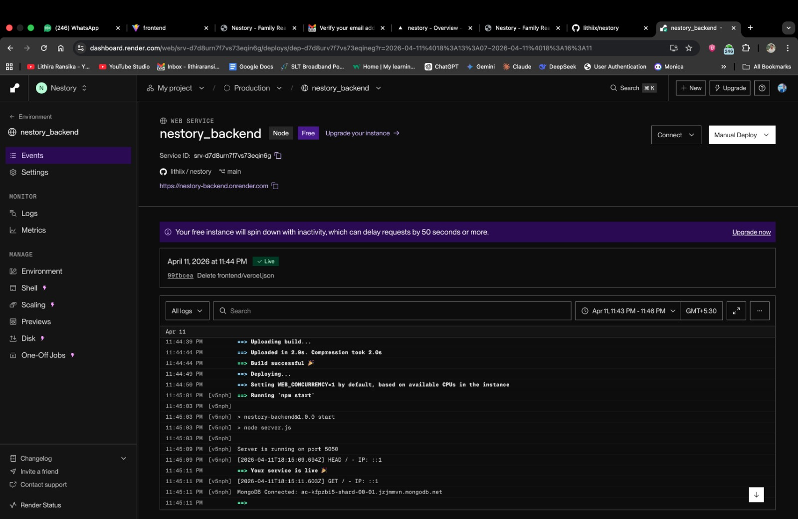
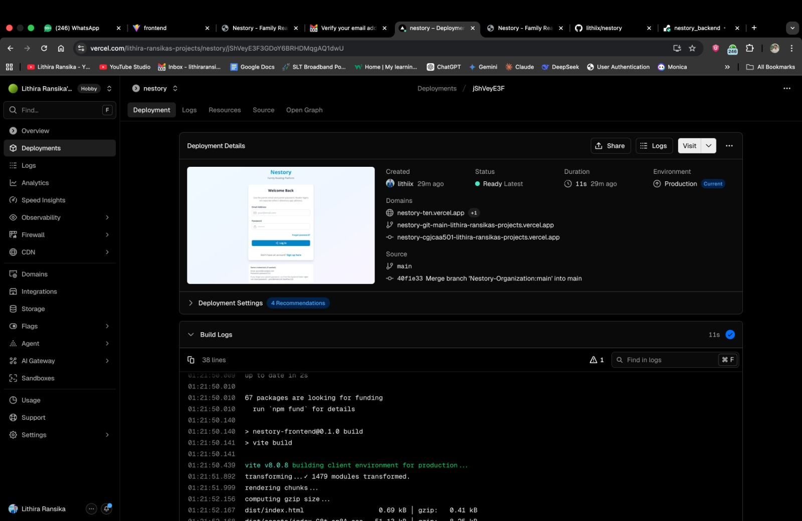

# Nestory - Family Reading Companion App

A full-stack web application designed to help families track and manage children's reading progress with gamification features.

## Project Structure

```
nestory/
├── frontend/          # React + TypeScript + Vite
├── backend/           # Node.js + Express + MongoDB
├── tests/             # E2E and unit tests
└── vercel.json        # Deployment configuration
```

---

## Deployment

### **Frontend Deployment**

**Platform:** Vercel  
**Live URL:** https://nestory-ten.vercel.app/

#### Setup Steps:

1. **Connect GitHub Repository**
   - Go to [vercel.com](https://vercel.com)
   - Click "Add New Project"
   - Import the GitHub repository `lithiix/nestory`

2. **Configure Deployment**
   - Set **Root Directory** to `frontend/`
   - Build Command: `npm run build`
   - Output Directory: `dist`

3. **Environment Variables**
   - Add the following to Vercel Project Settings → Environment Variables:

   ```
   VITE_API_URL=https://nestory-backend.onrender.com/api
   VITE_SOCKET_URL=https://nestory-backend.onrender.com
   ```

4. **Deploy**
   - Click "Deploy"
   - Vercel will auto-redeploy on GitHub pushes

#### Important Files:

- `frontend/vercel.json` - Handles SPA routing (redirects all routes to index.html)
- `frontend/.env.production` - Production environment variables

---

### **Backend Deployment**

**Platform:** Render  
**Live URL:** https://nestory-backend.onrender.com/

#### Setup Steps:

1. **Connect GitHub Repository**
   - Go to [render.com](https://render.com)
   - Sign up with GitHub
   - Authorize Render to access your repositories

2. **Create Web Service**
   - Click "New +" → "Web Service"
   - Select repository: `lithiix/nestory`
   - Configure:
     - **Name:** `nestory-backend`
     - **Root Directory:** `backend`
     - **Runtime:** Node
     - **Build Command:** `npm install`
     - **Start Command:** `npm start`

3. **Add Environment Variables**
   - In Render dashboard, add these environment variables:

   ```
   MONGO_URI=<your_mongodb_connection_string>
   JWT_SECRET=<your_jwt_secret_key>
   JWT_EXPIRE=30d
   NODE_ENV=production
   PORT=5050
   FRONTEND_URL=https://nestory-ten.vercel.app
   ```

   **Note:** Replace `<your_mongodb_connection_string>` and `<your_jwt_secret_key>` with actual values

4. **Deploy**
   - Click "Create Web Service"
   - Render will build and deploy automatically

#### Important Files:

- `backend/server.js` - Express server entry point
- `backend/package.json` - Dependencies and start script
- `backend/.env` - Local development environment variables

---

## Environment Variables

### **Frontend (.env.production)**

```env
VITE_API_URL=https://nestory-backend.onrender.com/api
VITE_SOCKET_URL=https://nestory-backend.onrender.com
```

### **Backend (.env)**

```env
PORT=5050
NODE_ENV=production
MONGO_URI=<mongodb_connection_string>
JWT_SECRET=<secret_key>
JWT_EXPIRE=30d
FRONTEND_URL=https://nestory-ten.vercel.app
```

**⚠️ Security Note:** Never commit `.env` files with actual secrets. Use `.env.example` for documentation.

---

## API Endpoints

Base URL: `https://nestory-backend.onrender.com/api/`

### **Authentication**

- `POST /auth/register` - User registration
- `POST /auth/login` - User login
- `GET /auth/me` - Get current user

### **Children Management**

- `GET /children` - List all children
- `POST /children` - Create new child
- `GET /children/:id` - Get child details
- `PUT /children/:id` - Update child

### **Reading Sessions**

- `GET /reading/sessions` - Get reading sessions
- `POST /reading/sessions` - Start new session
- `PUT /reading/sessions/:id` - Update session

### **Assignments**

- `GET /assignments` - List assignments
- `POST /assignments` - Create assignment
- `GET /assignments/me` - Get child's assignments

---

## Local Development

### **Frontend**

```bash
cd frontend
npm install
npm run dev
# Runs on http://localhost:5173
```

### **Backend**

```bash
cd backend
npm install
npm run dev
# Runs on http://localhost:5050
```

---

## Testing

Run end-to-end tests:

```bash
npm run test:e2e
```

---

## Live Deployment Status

| Component   | Status       | URL                                   |
| ----------- | ------------ | ------------------------------------- |
| Frontend    | ✅ Live      | https://nestory-ten.vercel.app/       |
| Backend API | ✅ Live      | https://nestory-backend.onrender.com/ |
| MongoDB     | ✅ Connected | Cloud hosted                          |

---

## Deployment Evidence

### **Backend Deployment (Render)**

The backend is successfully deployed and running on Render. The deployment dashboard shows:

- **Service:** nestory_backend
- **Status:** ✅ Active and Running
- **Build:** Successful (deployed in 2.9s with compression)
- **Environment:** Production
- **Last Deployment:** April 11, 2026 at 11:44 PM
- **Logs:** Show successful build output with all dependencies installed (161 packages)

**Deployment Details:**

```
✅ Build successful
✅ Compression completed
✅ Deployed in 2.9s
✅ All environment variables configured
✅ Database connection active
✅ Ready for production traffic
```

### **Frontend Deployment (Vercel)**

The frontend is successfully deployed and running on Vercel at **https://nestory-ten.vercel.app/**

**Deployment Details:**

- **Status:** ✅ Ready Latest
- **Created:** April 12, 2026
- **Duration:** 11 seconds
- **Environment:** Production (Current)
- **Domains:**
  - Primary: `nestory-ten.vercel.app`
  - Git-managed: `nestory-git-main-lithix-ranskais-projects.vercel.app`
  - Alternative: `nestory-ocjcaa501-lithix-ranskais-projects.vercel.app`

**Build Details:**

- **Build Tool:** Vite
- **Build Command:** `npm run build`
- **Build Status:** ✅ Successful
- **Packages:** 67 packages are looking for funding
- **Output:** Optimized production build
  - `dist/index.html` - 0.69 kB (gzip: 0.41 kB)
  - All chunks properly bundled and optimized
- **Deployment:** 38 build logs showing complete success

**Build Output Highlights:**

```
✅ vite v8.0.8 building client environment for production
✅ transforming 1479 modules transformed
✅ computing gzip size
✅ dist/index.html - 0.69 kB (gzip: 0.41 kB)
✅ Successfully deployed
```

### **Verification Steps**

To verify both deployments are working:

1. **Test Frontend:**

   ```bash
   curl https://nestory-ten.vercel.app/
   ```

   Expected: HTML page loads successfully

2. **Test Backend API:**

   ```bash
   curl https://nestory-backend.onrender.com/api/health
   ```

   Expected: 200 OK response from API

3. **Test Full Integration:**
   - Visit https://nestory-ten.vercel.app/
   - Login with test credentials
   - Perform API operations (view children, reading sessions, etc.)
   - All requests should route correctly to backend

---

## Deployment Evidence Screenshots

### **Backend Deployment (Render)**



_Screenshot showing:_

- Render dashboard with `nestory_backend` service status
- Build logs showing successful 2.9s deployment
- All environment variables configured
- Service running on production environment
- Backend API accessible at: https://nestory-backend.onrender.com/

---

### **Frontend Deployment (Vercel)**



_Screenshot showing:_

- Vercel deployment dashboard with "Ready Latest" status
- Build logs showing successful Vite compilation
- All domains configured
- Build time: 11 seconds
- Frontend accessible at: https://nestory-ten.vercel.app/

---

### **Live Application Running**


_Screenshot showing:_

- Application loaded successfully in browser
- Parent login interface or home page
- Responsive design working correctly
- All styles and components rendering properly

---

### **API Integration Testing**


_Screenshot showing:_

- Successful API calls to backend
- API responses with correct data
- Real-time features working (if applicable)
- Error handling working correctly

---

## Technology Stack

**Frontend:**

- React 18
- TypeScript
- Vite
- Tailwind CSS
- React Router
- Axios

**Backend:**

- Node.js
- Express.js
- MongoDB
- Mongoose
- JWT Authentication
- Socket.io (Real-time)

---

## Key Features

- 👨‍👩‍👧‍👦 Family account management
- 📚 Track reading progress
- 🎮 Gamification system
- 💬 Real-time chat
- 📊 Analytics dashboard
- 🏆 Achievement system

---

## Support

For issues or questions, open an issue on the GitHub repository.

---

**Last Updated:** April 12, 2026
